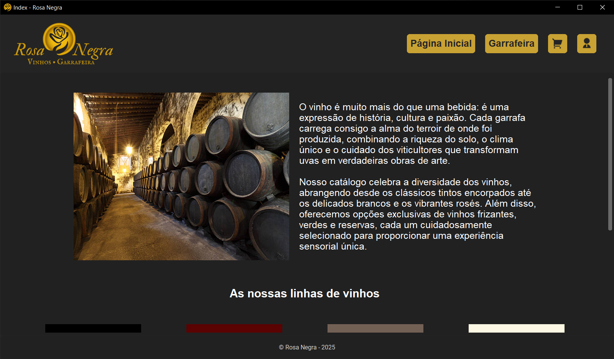

<div align="center">
   
</div>
<br>

Rosa Negra is an interactive application for managing and exploring wines and bottles in a unique way. This project combines modern technology with the sophistication of the wine world, providing a rich and functional experience.

## 📋 Features

- **Home Page**: Displays an introductory section with an image and text, followed by wine categories.
- **Product Page**: Lists all available wines with detailed information.
- **Cart Page**: Allows users to view and manage their selected wines.
- **Login and Register Pages**: Provides user authentication and registration functionalities.
- **Profile Page**: Displays user profile information.
- **Dashboard**: Admin dashboard for managing products, users, and purchases.
- **Product Management**: Allows admins to manage wine products.

## 🏗️ Technologies Used

- **Python**: Main language for backend and logic.
- **CustomTkinter**: Framework for modern graphical interfaces.
- **Pillow (PIL)**: Image manipulation.
- **Additional Libraries**: `bcrypt`, among others.

## 🛠️ Installation

Follow the steps below to set up the project locally:

1. Clone the repository:
   ```sh
   git clone https://github.com/kalebeccs/rosa-negra-ipluso.git
   ```
2. Navigate to the project directory:
   ```sh
   cd rosa-negra-ipluso
   ```
3. Create a virtual environment:
   ```sh
   python -m venv .venv
   ```
4. Activate the virtual environment:
   - On Windows:
     ```sh
     .venv\Scripts\activate
     ```
   - On macOS/Linux:
     ```sh
     source .venv/bin/activate
     ```
5. Install the required dependencies:
   ```sh
   pip install -r requirements.txt
   ```
6. Initialize the database:
   ```sh
   python db/init_db.py
   ```

## 🚀 Usage

1. Run the application:
   ```sh
   python run.py
   ```
2. The application will start, and you can navigate through the different sections using the provided interface.

## 📁 Project Structure

```plaintext
rosa-negra-ipluso/
├── app/
│   ├── assets/
│   └── views/
├── db/
├── src/
│   ├── models/
│   └── utils/
├── README.md
├── requirements.txt
└── run.py
```

## 🖼️ Preview


